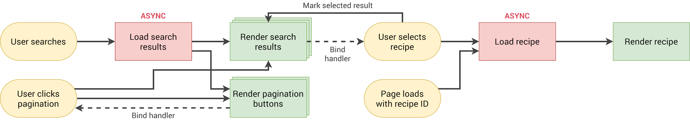

# 🍽️ Forkify - Recipe Search & Management Application

A modern, responsive web application for discovering, viewing, and managing your favorite recipes. Built with vanilla JavaScript using the MVC (Model-View-Controller) architecture pattern.


## 🌟 Features

### 🔍 Recipe Search
- Search through over 1,000,000 recipes from various publishers
- Real-time search results with pagination
- Interactive recipe cards with preview images

### 📖 Recipe Details
- Detailed recipe view with high-quality images
- Cooking time and serving size information
- Complete ingredient lists with quantities
- Adjustable serving sizes with automatic ingredient scaling
- Direct links to original recipe sources

### 📚 Bookmark Management
- Save your favorite recipes for quick access
- Persistent bookmarks using local storage
- Visual indicators for bookmarked recipes

### ➕ Custom Recipe Upload
- Add your own recipes to the collection
- User-generated content with custom API key integration
- Form validation for proper ingredient formatting

### 📱 Responsive Design
- Mobile-first approach
- Optimized for all screen sizes
- Modern UI with smooth animations

## 🚀 Live Demo

Try the application: [Forkify Live Demo](https://your-demo-url.com)

## 🛠️ Technologies Used

- **Frontend**: Vanilla JavaScript (ES6+), HTML5, CSS3/Sass
- **Build Tool**: Parcel bundler
- **API**: [Forkify API](https://forkify-api.jonas.io) for recipe data
- **Architecture**: MVC (Model-View-Controller) pattern
- **Storage**: Local Storage for bookmarks persistence
- **Styling**: Sass with BEM methodology

## 📦 Dependencies

### Production Dependencies
- `core-js` - JavaScript polyfills for older browsers
- `fractional` - Fraction formatting for recipe quantities
- `regenerator-runtime` - Async/await support

### Development Dependencies
- `parcel` - Fast, zero configuration web application bundler
- `sass` - CSS preprocessor
- Various Parcel transformers and polyfills

## 🏗️ Architecture

The application follows the MVC architecture pattern:

### Model (`src/js/model.js`)
- Manages application state
- Handles API interactions
- Recipe and search data management
- Bookmark persistence logic

### Views (`src/js/views/`)
- `recipeView.js` - Recipe display and interactions
- `searchView.js` - Search form handling
- `resultsView.js` - Search results display
- `paginationView.js` - Results pagination
- `bookmarksView.js` - Bookmarks management
- `addRecipeView.js` - Recipe upload form

### Controller (`src/js/controller.js`)
- Coordinates between Model and Views
- Handles user interactions
- Manages application flow

### Configuration (`src/js/config.js`)
- API endpoints and settings
- Application constants

### Helpers (`src/js/helpers.js`)
- Utility functions
- API request handling
- Error management

## 🔧 Installation & Setup

1. **Clone the repository**
   ```bash
   git clone https://github.com/prof-biney/forkify.git
   cd forkify
   ```

2. **Install dependencies**
   ```bash
   npm install
   ```

3. **Start development server**
   ```bash
   npm start
   ```
   The application will be available at `http://localhost:1234`

4. **Build for production**
   ```bash
   npm run build
   ```

## 🎯 Usage Guide

### Searching for Recipes
1. Enter ingredients or recipe names in the search bar
2. Browse through paginated results
3. Click on any recipe card to view details

### Viewing Recipe Details
- See cooking time and serving information
- Adjust serving sizes using +/- buttons
- View complete ingredient list
- Access original recipe source

### Managing Bookmarks
- Click the bookmark icon to save recipes
- Access bookmarks via the bookmarks dropdown
- Bookmarks persist between browser sessions

### Adding Custom Recipes
1. Click the "Add recipe" button
2. Fill in recipe details and ingredients
3. Use the format: `Quantity,Unit,Description` for ingredients
4. Submit to add to your personal collection

## 📱 API Integration

The application uses the [Forkify API](https://forkify-api.jonas.io) which provides:
- Recipe search functionality
- Detailed recipe information
- User recipe upload capabilities

### API Endpoints
- **Search**: `GET /api/v2/recipes?search={query}`
- **Recipe Details**: `GET /api/v2/recipes/{id}`
- **Upload Recipe**: `POST /api/v2/recipes`

## 🎨 Design System

### Color Palette
- Primary: Modern oranges and warm tones
- Secondary: Clean grays and whites
- Accent: Interactive blues for buttons and links

### Typography
- Font Family: Nunito Sans
- Responsive typography scales
- Clear hierarchy with heading styles

### Layout
- CSS Grid for main layout structure
- Flexbox for component alignment
- Mobile-first responsive design

## 🔄 State Management

The application maintains state for:
- Current recipe being viewed
- Search results and pagination
- User bookmarks
- Search query and filters

State is managed through a centralized model with reactive updates to the UI.

## 📊 Performance Optimizations

- **Lazy Loading**: Images loaded on demand
- **Pagination**: Results loaded in chunks
- **Local Storage**: Bookmarks cached locally
- **Efficient DOM Updates**: Minimal re-renders
- **Bundle Optimization**: Tree-shaking with Parcel

## 🔐 Security Features

- Input sanitization for user-generated content
- API key management
- Safe HTML rendering practices
- HTTPS API endpoints

## 🧪 Testing

The application includes:
- Manual testing procedures
- Cross-browser compatibility checks
- Responsive design testing
- API integration testing

## 📈 Future Enhancements

- [ ] User authentication system
- [ ] Recipe rating and reviews
- [ ] Advanced search filters
- [ ] Shopping list generation
- [ ] Nutritional information display
- [ ] Social sharing features
- [ ] Offline functionality
- [ ] Recipe collections/categories

## 🤝 Contributing

Contributions are welcome! Please follow these steps:

1. Fork the repository
2. Create a feature branch (`git checkout -b feature/AmazingFeature`)
3. Commit your changes (`git commit -m 'Add some AmazingFeature'`)
4. Push to the branch (`git push origin feature/AmazingFeature`)
5. Open a Pull Request

### Development Guidelines
- Follow existing code style and patterns
- Use meaningful commit messages
- Add comments for complex logic
- Test thoroughly before submitting

## 📄 License

This project is licensed under the ISC License - see the LICENSE file for details.

## 👨‍💻 Author

**Andrew Biney**
- GitHub: [@prof-biney](https://github.com/prof-biney)
- Email: [your.email@example.com](mailto:your.email@example.com)

## 🙏 Acknowledgments

- Recipe data provided by [Forkify API](https://forkify-api.jonas.io)
- Icons from various open-source icon libraries
- Inspiration from modern cooking applications
- Thanks to the JavaScript community for excellent resources

## 📸 Screenshots

### Desktop View


### Mobile Responsive


### Recipe Details


### Architecture Overview


---

## 📞 Support

If you encounter any issues or have questions:
1. Check the [Issues](https://github.com/prof-biney/forkify/issues) page
2. Create a new issue with detailed description
3. Contact the maintainer directly

---

**Happy Cooking! 🍳**
